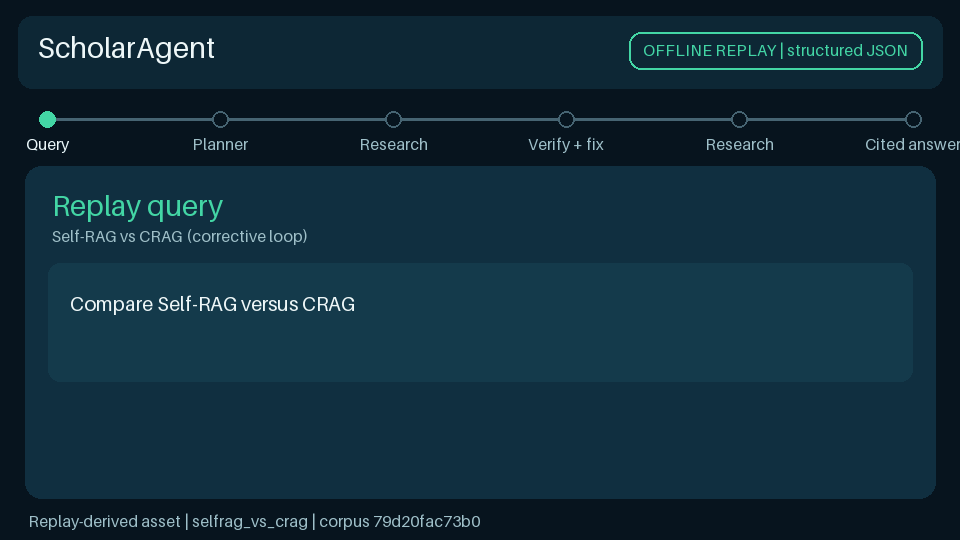
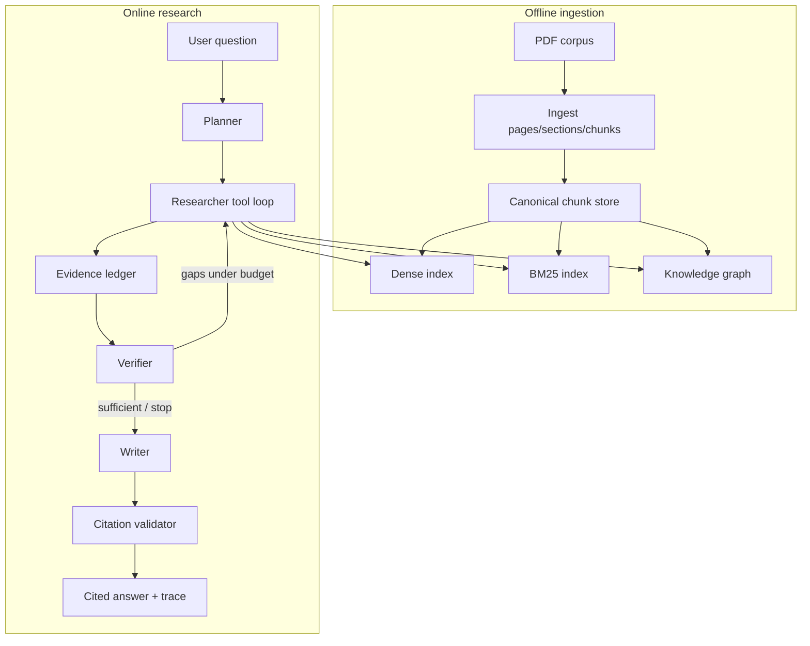

# ScholarAgent

Evidence-driven multi-agent GraphRAG for literature research.



*Replay-derived, provider-free demo: plan → adaptive retrieval → verification →
page-grounded answer. Generate it with `scripts/build_demo_gif.py`.*

A **Planner** decomposes complex questions, a **Researcher** chooses hybrid or
graph retrieval tools under budgets, a **Verifier** checks evidence coverage and
may request corrective retrieval, and a **Writer** answers only from verified
evidence—with ablations to measure what actually helps.

**Status:** Phases 0–10 implemented. The objective acceptance matrix is in
[`docs/phase_acceptance.md`](docs/phase_acceptance.md); full design:
[`CODEX_IMPLEMENTATION_PLAN.md`](CODEX_IMPLEMENTATION_PLAN.md).

> Language note: this is a **portfolio research prototype**, not a production
> service. Claims below are measured, fixture-backed, or explicitly unavailable.

---

## Why naive RAG fails

| Failure mode | What happens | What ScholarAgent does |
|---|---|---|
| Dense-only miss | Exact dataset/method names rank poorly | Hybrid dense + BM25 with explicit RRF |
| Uncited fluency | Model invents claims without pages | Writer restricted to verified ledger IDs |
| Fixed pipeline | Same retrieve→generate for every query | Adaptive router + tool loop |
| No stop condition | Agents thrash on tools | Corrective budgets, no-new-evidence stop |
| Graph as oracle | Triples treated as facts | Provenance-backed edges only |

**Measured (offline hash embeddings, frozen 50-Q split, clean run `run_1f4dc371453d4a1f`):**
dense-only paper Recall@8 **0.16** vs hybrid_rerank **0.61**. Source:
[`docs/results/offline_hash_eval_summary.md`](docs/results/offline_hash_eval_summary.md).

---

## Architecture



Also see [`docs/architecture.md`](docs/architecture.md).

### Agent responsibilities

| Role | Responsibility |
|---|---|
| **Planner** | Structured `QueryPlan` with sub-questions and required evidence |
| **Researcher** | Budgeted tool loop (dense / sparse / hybrid / graph); merges evidence ledger |
| **Verifier** | Coverage, conflicts, targeted corrective queries; never infinite loops |
| **Writer** | Claims only from Verifier-accepted evidence IDs; page citations from ledger |
| **Citation validator** | Canonical chunk/PDF/page checks; drops unsupported claims |

### Retrieval stack

- **Dense** — Chroma + BGE (or offline hashing embedder)
- **BM25** — persistent, aligned to stable `chunk_id`s
- **RRF** — explicit reciprocal rank fusion (`k=60` default)
- **Rerank** — cross-encoder in production path; lexical offline/hash eval
- **Graph** — constrained ontology, evidence spans, staged entity resolution
- **Adaptive routing** — rule-based policy from query type / signals

### Evidence ledger example (from committed demo replay)

Replay: `data/demo/runs/selfrag_vs_crag.json`

| evidence_id | paper_id | pages | claim support (snippet) |
|---|---|---|---|
| `ev_selfrag` | `paper_arxiv_2310_11511` | p.10–11 | Self-RAG / reflection tokens |
| `ev_crag` | `paper_arxiv_2401_15884` | p.1 | CRAG corrective retrieval |

Final answer cites `[paper_arxiv_2310_11511 p.10-11]` and
`[paper_arxiv_2401_15884 p.1]`. Replay loading rechecks these mappings against
the current canonical store when local artifacts are available.

---

## Corpus statistics

| Item | Value | Evidence |
|---|---|---|
| Manifest entries | **120** arXiv PDFs | `data/corpus_manifest.jsonl` |
| Locally ingested papers | **120** (when PDFs present) | `data/processed/papers.jsonl` (gitignored) |
| Chunks | **5858** | local `data/processed/chunks.jsonl` |
| Pages (last ingest report) | **2593** | local `ingestion_report.json` |
| Graph nodes / edges | **2636 / 4263** | local `graph_stats.json` via `graph stats` |
| Relations with evidence | **4263 / 4263** | independent PDF-span audit; 4181 single-page + 82 cross-page |
| PDFs committed? | **No** | `.gitignore` — download via script |

If you clone without downloading PDFs, treat full-corpus stats as **unavailable
until** `download_corpus.py` + `ingest` complete. Fixture corpus under
`tests/fixtures/` is always available for offline tests.

---

## Evaluation

### Dataset (frozen)

| Type | Count |
|---|---:|
| Single-paper factual | 10 |
| Exact terminology / keyword | 10 |
| Cross-paper comparison | 15 |
| Multi-hop relational | 10 |
| Unanswerable from corpus | 5 |

Artifacts: `data/evaluation/{questions,reference_evidence,frozen_split}.jsonl|json`.

### Ablation systems

`naive_dense` · `hybrid_rag` · `hybrid_rerank` · `hybrid_graph` ·
`hybrid_corrective` · `full_agent` · `static_all_tools`

### Quantitative results (measured offline)

**Configuration:** hashing embedder + lexical rerank · graph loaded · no live LLM ·
cost $0.00 · clean run `run_1f4dc371453d4a1f` · corpus fingerprint `79d20fac…`.
Full table: [`docs/results/offline_hash_eval_summary.md`](docs/results/offline_hash_eval_summary.md).

| system | paper R@8 | cite P | latency ms |
|---|---:|---:|---:|
| naive_dense | 0.16 | 0.038 | 3.6 |
| hybrid_rerank | 0.61 | 0.166 | 10.7 |
| hybrid_graph | **0.67** | 0.212 | 289.9 |
| full_agent | 0.54 | **0.288** | 572.2 |

**Per-category (paper R@8):** hybrid_rerank factual/keyword **0.90**; comparison
**0.57**; relational **0.40**. Full agent unanswerable refusals: **5/5**.
Corrective loops trigger safely but `improvement_after_correction = 0.0` offline.

**Full live shared-LLM + RAGAS 50×7** (`run_a23467bb0aa84115`, DeepSeek flash,
hash retrieval):
[`docs/results/live_llm_ragas_50x7_summary.md`](docs/results/live_llm_ragas_50x7_summary.md).

| system | paper R@8 | cite P | RAGAS faith. | RAGAS relev. |
|---|---:|---:|---:|---:|
| hybrid_rerank | 0.61 | 0.603 | 0.922 | 0.549 |
| hybrid_graph | **0.67** | **0.620** | **0.959** | **0.583** |
| full_agent | 0.54 | 0.491 | 0.877 | 0.492 |

RAGAS coverage **0.90** because 5 unanswerable questions × 7 systems correctly
refuse (empty answer → no RAGAS score). Generation used on **350/350** rows;
**0** system errors.

**BGE + cross-encoder full 50×7 (measured):**

| regime | run | best paper R@8 | notes |
|---|---|---:|---|
| Offline extractive | `run_a4770534afb84db2` | static_all_tools **0.73** (dense alone **0.70**) | [`docs/results/bge_ce_offline_50x7_summary.md`](docs/results/bge_ce_offline_50x7_summary.md) |
| Live LLM + RAGAS | `run_6270c2cf8cd94186` | static_all_tools **0.73** | CE lifts MRR; hybrid_rerank cite P **0.660**, full_agent RAGAS faith. **0.965** — [`docs/results/bge_ce_llm_ragas_50x7_summary.md`](docs/results/bge_ce_llm_ragas_50x7_summary.md) |

Vs hash offline, dense-only paper R@8 jumps **0.16 → 0.70**.

**Fixture-only:** unit/E2E tests under `tests/` (not full-corpus metrics).

**Dataset review:** 50/50 AI-assisted independent review
(`data/evaluation/manual_review_manifest.json`) — **not** human-signed audit.

Failure analysis: [`docs/failure_analysis.md`](docs/failure_analysis.md).

---

## Setup

```bash
# Python 3.11+ and uv (https://github.com/astral-sh/uv)
uv sync
cp .env.example .env   # optional: DEEPSEEK_API_KEY for live checks only

# Offline quality gates (no paid APIs)
make quality
# or:
uv run pytest -m "not live" -q
uv run ruff check .
uv run ruff format --check .
uv run mypy src
```

### Optional full corpus (local)

```bash
uv run python scripts/download_corpus.py --target 120 --skip-existing
uv run scholar-agent corpus validate -m data/corpus_manifest.jsonl --check-pdfs
uv run scholar-agent ingest --manifest data/corpus_manifest.jsonl
uv run scholar-agent index build --embedding-backend st
uv run scholar-agent graph build
```

Canonical ingestion requires the configured exact tokenizer
(`tiktoken:cl100k_base`) and records its backend plus an ingestion-configuration
fingerprint. `--allow-tokenizer-fallback` is an explicit non-canonical diagnostic
escape hatch; it is never used for the measured corpus.

---

## CLI usage

```bash
uv run scholar-agent --help
uv run scholar-agent corpus validate -m tests/fixtures/corpus_manifest.jsonl
uv run scholar-agent ingest --help
uv run scholar-agent graph inspect
uv run scholar-agent ask --help
uv run scholar-agent evaluate --help
```

| Command | Description |
|---|---|
| `scholar-agent version` | Package version |
| `scholar-agent config` | Show validated config |
| `scholar-agent corpus validate` | Manifest validation |
| `scholar-agent ingest` | PDF → processed JSONL |
| `scholar-agent index build` | Dense + BM25 indexes |
| `scholar-agent retrieve "…"` | Search modes |
| `scholar-agent ask-naive "…"` | Naive RAG baseline |
| `scholar-agent graph build\|inspect` | Knowledge graph |
| `scholar-agent ask "…"` | Full plan→verify→write→cite |
| `scholar-agent evaluate` | Frozen-split ablations |
| `scholar-agent demo` | Streamlit or offline replay |

---

## Tests

```bash
# Core offline suite (default CI)
uv run pytest -m "not live" -q

# Optional live provider tests (requires API key; never default)
uv run pytest -m live
# or
make test-live

# Targeted
uv run pytest tests/unit/test_e2e_fixture.py tests/unit/test_hardening.py -q
```

Live tests are marked `live`, skip without credentials, and must not log secrets
or provider reasoning fields.

---

## Streamlit demo

```bash
uv sync --extra ui
make demo
# Offline interview-safe replay:
uv run scholar-agent demo --replay selfrag_vs_crag
```

Full script: [`docs/demo_script.md`](docs/demo_script.md). UI notes: [`docs/demo.md`](docs/demo.md).
The committed GIF above is rebuilt from the same provenance-checked replay data,
so the interview path does not require a provider or browser session.

---

## Design decisions & reliability

- Design ADRs: [`docs/design_decisions.md`](docs/design_decisions.md)
- Caching policy: [`docs/caching.md`](docs/caching.md)
- Interview guide: [`docs/interview_guide.md`](docs/interview_guide.md)
- 中文项目状态与面试要点: [`docs/interview_project_summary_zh.md`](docs/interview_project_summary_zh.md)
- Evaluation ops: [`docs/evaluation.md`](docs/evaluation.md)
- Phase acceptance evidence: [`docs/phase_acceptance.md`](docs/phase_acceptance.md)

Hardening highlights (Phase 10): config validation, structured LLM parse/retry,
provider backoff with jitter, workflow budgets, graceful index degradation,
disk cache with corruption handling, untrusted-content delimiters, secret-safe logs.

---

## Limitations

1. Offline hash metrics are **not** BGE/cross-encoder production quality.
2. Corrective loops **trigger but do not improve** gold paper recall offline
   (`improvement_after_correction = 0.0`).
3. Graph improves paper recall but multiplies latency (~30× in that run).
4. PDFs, indexes, and raw eval outputs are local (gitignored).
5. Single-user CLI/Streamlit prototype — not multi-tenant production.
6. The committed demo GIF is a deterministic saved-run replay, not a live video.

## Future work

- Larger and out-of-domain evaluation for BGE/cross-encoder retrieval
- Stronger entailment/refusal checks on a development set
- Score-calibrated hybrid+graph fusion
- Multi-user API, auth, quotas, managed vector DB
- Optional extensions listed in the implementation plan §21 (only after core DoD)

## License

MIT (portfolio project).
