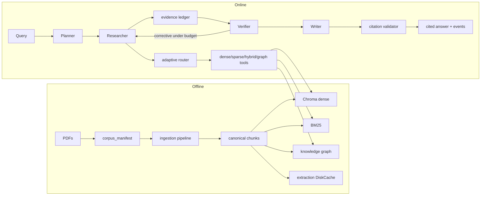

# Architecture (Phases 0–10)

ScholarAgent is an evidence-driven multi-agent literature research system.
This document tracks the architecture **as implemented**.

## System diagram



## Offline path

```text
PDF corpus
  → metadata + page parsing (PyMuPDF)
  → prevalence-based header/footer cleanup + section/page-span mapping
  → exact-token chunking (stable chunk_id + minimal physical page range)
  → canonical chunk store (source of truth)
  → dense index / BM25 / provenance-linked graph
  → optional extraction disk cache
```

## Online path

```text
User query
  → Planner (structured QueryPlan)
  → Research Agent tool loop (budgets + events)
  → Evidence Ledger (deterministic merge/dedupe)
  → Verifier (gaps, conflicts, corrective queries)
  → Writer (verified evidence only)
  → Citation validator (chunk/page/PDF checks)
  → answer + sources + execution trace
```

## Component map

| Component | Location | Role |
|---|---|---|
| Config | `scholar_agent.config` | YAML + env, Pydantic validation |
| Logging | `scholar_agent.logging` | Secret-safe structured logs |
| Stable IDs | `scholar_agent.ids` | Paper/chunk/entity/evidence IDs |
| Models | `scholar_agent.models` | Domain + `StructuredError` / events |
| Storage | `scholar_agent.storage` | JSONL, manifest, `DiskCache` |
| LLM client | `scholar_agent.llm` | DeepSeek-compatible + retry/jitter |
| Prompts | `scholar_agent.llm.prompts` | Untrusted-content delimiters |
| Ingestion | `scholar_agent.ingestion` | PDF → pages → chunks |
| Retrieval | `scholar_agent.retrieval` | Dense, BM25, RRF, rerank, tools |
| Graph | `scholar_agent.graph` | Extract, resolve, store, retrieve |
| Agents | `scholar_agent.agents` | Planner, researcher, verifier, writer, workflow |
| Evaluation | `scholar_agent.evaluation` | Frozen split + ablations |
| Demo UI | `scholar_agent.app` | Streamlit + offline replay |
| CLI | `scholar_agent.cli` | End-user commands |

## Graph provenance and entity resolution

1. Extract relations with **evidence spans** grounded in chunk text.
2. Reload the PDF and localize each complete span to its minimal contiguous
   physical-page window; drop spans that cannot be localized.
3. Resolve surfaces: seed aliases → string/embedding candidates → optional LLM judge.
4. Persist NetworkX MultiDiGraph node-link JSON plus build metadata; every edge
   joins back to `chunk_id` and its own `page_number`–`page_end` range.
5. Runtime loading rejects stale/partial graphs whose corpus or schema identity
   differs from the canonical chunk store.

## Corrective loop termination

Stops when any of:

- evidence sufficient;
- max corrective iterations;
- no new evidence IDs;
- global tool / token / latency budget;
- unanswerable after targeted exhaustion.

## Reliability (Phase 10)

- Fail-fast config validation; offline import without API keys.
- Structured output parse + bounded repair/retry.
- Provider retries: timeouts, 429, 5xx; never auth/validation.
- Graceful degradation when graph/index missing (`degraded` debug / empty hits).
- Retrieved text delimited as untrusted data.
- Disk cache: versioned keys, atomic writes, corruption → miss.
- Artifact identity: dense, sparse, graph, evaluation, and replay records bind to
  the canonical corpus fingerprint; stale graph/replay data is rejected.

## Constraints

1. Pydantic models at module boundaries
2. Stable IDs and page provenance end-to-end
3. Canonical chunk store is source of truth
4. Graph triples are not facts without source evidence
5. No user-facing chain-of-thought
6. Tool, iteration, token, latency budgets
7. Live paid-provider tests optional (`pytest -m live`)
